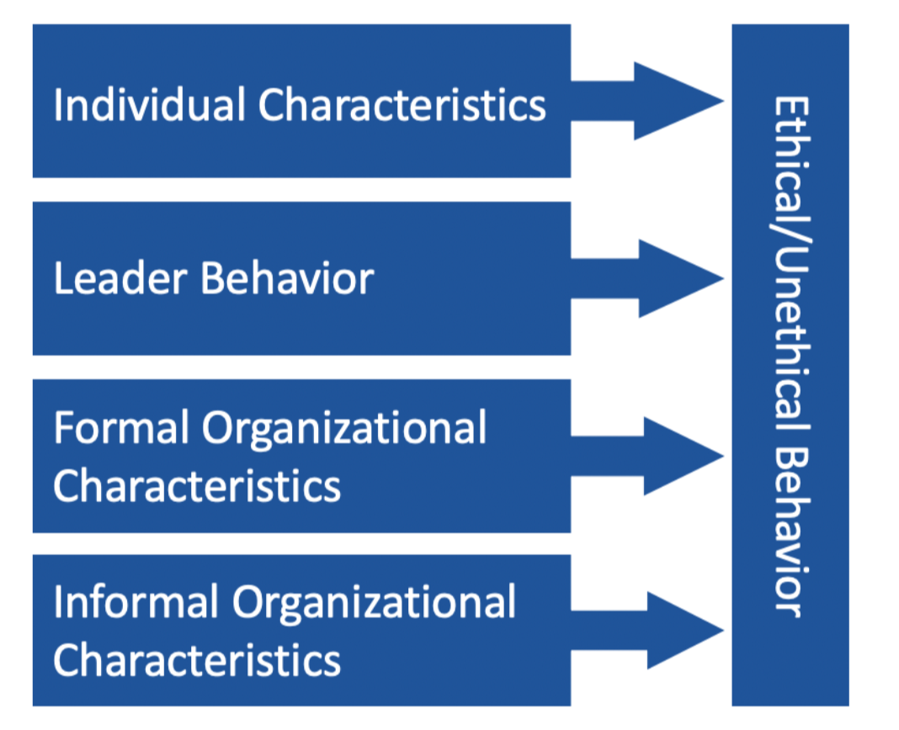

# Module 1

## Merck

* if enough of the population is treated, will eliminate disease from the region
* company policy generally eliminated from consideration or production any drug that was not generating at least roughly $20 million of revenue per year
* First, Merck had no experience getting a drug to people in remote locations and could not plan to rely on potentially unreliable government health systems.
* “Medicine is for the people. It is not for the profits. The profits follow, and if we have remembered that, they have never failed to appear.”
* **ethical values of a company, embedded in its culture, can be deeply connected to its overall success**.


Your organization’s ethics can constitute a value-adding asset that needs to be developed and managed well like any other value adding asset according to _**resource-based theory**_ of strategic management, organizational resources that produce sustainable competitive advantage are those that are valuable, rare, have no substitutes, and are hard to imitate. Intangible resources, such as the ethical climate or culture of an organization, thus can be very important strategic resources.


* talent, values of company reflect personal values, what we can do for society
* financial lense is lagging, leading is talent, people make company successful 
* **it was the ongoing ethical stance embodied in Merck’s culture that was the basis for one of Merck’s key strategic resources, and not just a possibly transient decision to spend money on an ethically noble project.**
* Merk took on this project because it contributed to their company's own ethical views, it will help retain the intangible talent of their employees, thereby continuing profits

## Resource Based Theory

* organizations that own strategic resources have competitive advantages to other companies
* resource is strategic if rare, difficult to imitate, and non substitutable

## Resource Based Theory of Sustainable Comp Advantage

* strategic resources create sustainable comp advantage which creates profit
  * Satisfying only one or two of the valuable, rare, difficult to imitate, non substitutable criteria will likely only lead to competitive parity or a **temporary** advantage.
  * Sustained advantage is one over time and helps firm stay successful far into the future

| Strategic Resource |  |
| :--- | :--- |
| Valuable | resources aid in improving the organization’s effectiveness and efficiency while neutralizing the opportunities and threats of competitors. |
| Rare | resources are those held by few or no other competitors. |
| Difficult to Imitate | resources often involve legally protected intellectual property such as trademarks, patents, or copyrights. Other difficult-to-imitate resources, such as brand names, usually need time to develop fully |
| Non Substitutable | esources exist when the resource combinations of other firms cannot duplicate the strategy provided by the resource bundle of a particular firm |

* **Tangible resources --&gt;** can be seen and quantified, cash, equipment
* **Intangible resources --&gt;** hard to quantify \(knowledge and skills of employees, reputation, culture of firm
* **Dynamic capability --&gt;** exists when a firm is skilled at continually updating its array of capabilities to keep pace with changes in its environment

## Ethics Pays


good ethics leading to performance benefits does not mean that it always will; sometimes there will be hard choices to make between doing the right thing and maximizing profits


* firms that are ethical enjoy an enhanced reputation and an increased ability to attract and retain the best talent
* bad ethics can lead to short term financial damage and long term reputation damage
* an investment in ethics creates a long-term value-add for shareholders and other stakeholders
* Employees of ethical companies enjoy a high-trust environment in which leaders model the behaviors they expect from their teams. 
* An ethical culture perpetuates itself by attracting ethical employees
* Your organization’s ethics function should look beyond regulatory compliance.
  *  It should cut across your entire company and foster collaboration to influence your company’s culture.

## Toby Groves & the Psychology of Fraud

> ethical failures in the workplace can have serious negative impacts on individual employees and managers and on an entire organization

* individuals and the helpers
* cognitive frame \(making best business decision, vs ethical decision\)
  * cognitive blind spots can't process
* why spread so fast to the helpers?
* we want to help people, feel empathy
* fraud because they are greedy not because they are nice
  * can't process decision in the moment
* **ethical fading** --&gt; ethical before, at time of decision all of these other factors like hungry tired angry make me behave differently
* if other people don't react to your unethical decision thinks it's alright
* **overconfidence bias** --&gt; eventually things will get better, I will be able to repay the money, "oh I can jump higher than him"
* **fundamental attribution error --&gt;** bad actors who are responsible for the unethical action
* organization is has strict quotas and then employees feel that they need to do whatever they can to meet the quotas so that they can remain in good standing at the company \(bad barrel bad apple\)
  * like cheating in school
* you can protect your own sense of being an ethical business person, and also avoid becoming a negative influence on others.

want to win instead of being ethical

## Trading Floor

* largest transaction, complex, aggressive supervisor
* close relationship with CFO of Poseidon cruise lines
* exaggerated need for secrecy, Poseidon never look at other investment banks
* rates Linda proposed were 80 basis points higher than the rates the traders need to profit
* First America would profit 1.2 million off of the deal, highest fee to hedge risk

## Ethical Fading

* **ethical fading --&gt;** People can neglect the ethical implications of a decision because they are focused on other elements of the choice in front of them
  * during decision the want prevails over the right
  * Being fully aware of blind spots before taking action helps people make more ethical decisions leading to personal and professional prestige.
* research shows that highlighting good behavior induces more virtuous behavior as opposed to solely punishing those who transgress
* considering the long term results can reduce employee turnover and strengthen the company’s reputation. Put another way, ethics are more prominent if decisions are framed with long-term reputation and organizational sustainability in mind.

## Madoff Video

* I wouldn't understand if I asked
* too many clients to operate as unregistered investment advisors
* was wondering if they should have been licensed \(don't worry you're my clients lawyers said it's ok\)
* Bernie didn't want to get licensed \(owned Us\)
* blamed Bernie that he didn't want them to get licensed
* Bernie didn't get in trouble at first
* new in between company feed money to Bernie
* aggressive in catching new clients
* thousands of clients and billions but name Madoff couldn't be anywhere publicly because he wasn't registered with the SEC
* everyone operated with Madoff's secrecy rules
  * people said "I don't know that Madoff did want to be public"
  * "something you didn't talk about"
* when did it become fraud? still a question
* good company to work for people didn't leave you stayed there
* woman who said wanted more transparency from hedge funds, didn't fully answer the question
* intimidated 
* "we make the assumption that he's doing everything properly, he's a well known broker"

## Ethics and Your Business Career

* if they say I'll report to CEO and SEC then they're not thinking through
* want to compete with people above you, think they're above rules arrogance
* do something, talk about it with group of people
* don't excuse inaction because you are new at a firm

